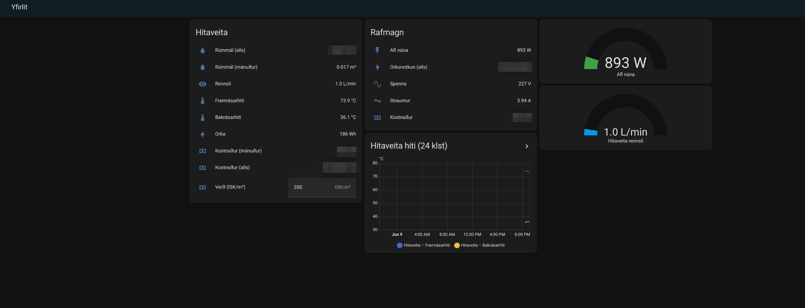

# Hitaveita (district hot water) → Home Assistant, via a HomeWizard P1 meter

Bring an **MBus heat / hot-water meter** (e.g. Icelandic *hitaveita* district heating) into
Home Assistant when it's attached to a **HomeWizard Wi-Fi P1 meter** — including **volume, live
flow, supply/return temperature, heat energy**, a **monthly usage meter**, and a simple
**cost** estimate.

> **Why this is needed:** the HomeWizard P1 exposes your **electricity** meter through its local
> `GET /api/v1/data`, and HA's official HomeWizard integration uses that. But an attached **MBus
> heat/water meter is _not_ parsed into the `external` array** of `/api/v1/data` (it comes back
> `"external": []`). The data *is* present in the **raw P1 telegram** (`GET /api/v1/telegram`) on
> MBus channel `0-1:24.2.x`, so this project scrapes the telegram with a small REST sensor.

No add-ons or custom components required — just YAML.



---

## Does this apply to me?

You can use this if **all** of these are true:

1. You have a **HomeWizard Wi-Fi P1 meter** with the **local API enabled** (HomeWizard app → device →
   *Local API*).
2. A **heat / hot-water (MBus) meter** is connected to your smart meter's P1 port (common with
   Icelandic *hitaveita*, and some district-heating setups elsewhere).
3. The meter's readings appear in the telegram but **not** in `/api/v1/data`'s `external` array.

**Quick check** (replace the IP with your P1's address):

```bash
# Electricity only? Heat meter missing here?
curl -s http://YOUR_P1_IP/api/v1/data | grep external      # often: "external":[]

# But present in the raw telegram on an MBus channel:
curl -s http://YOUR_P1_IP/api/v1/telegram | grep -E '0-1:24\.2\.'
```

Example telegram lines (this is what we parse):

```
0-1:24.2.1(1234.567*m3)      # cumulative volume
0-1:24.2.2(0000.050*m3/h)    # live flow
0-1:24.2.3(000070.0*degC)    # supply temperature
0-1:24.2.4(000035.0*degC)    # return temperature
0-1:24.2.5(0123.456*Wh)      # heat energy register
```

> **Find your channel.** The examples use MBus channel **`0-1`**. Some installs put the heat meter
> on `0-2` or `0-3`. Run the `grep` above; if you see `0-2:24.2.x` instead, change `0-1` to `0-2`
> everywhere in `packages/hitaveita.yaml`.

---

## Install

### 1. Enable packages (one-time)

In `configuration.yaml`:

```yaml
homeassistant:
  packages: !include_dir_named packages
```

### 2. Add the package

Copy [`packages/hitaveita.yaml`](packages/hitaveita.yaml) into your HA `config/packages/` folder
and **edit two things**:

- replace `YOUR_P1_IP` with your P1 meter's IP,
- confirm the MBus channel (`0-1` by default — see above).

*(Alternatively, paste the contents of the package straight into `configuration.yaml`.)*

### 3. Check & restart

- **Developer Tools → YAML → Check configuration**, then **Restart**.
- ⚠️ On a low-RAM Home Assistant **VM (≤1 GiB)**, `ha core check` / restarts can thrash. **2 GiB+**
  recommended.

### 4. Set the price & add to dashboards

- Set **`input_number.hitaveita_verd_per_m3`** to your tariff (ISK per m³) in the UI.
- Add **`sensor.hitaveita_rummal`** under **Settings → Dashboards → Energy → Water consumption**
  (it's `device_class: water` + `state_class: total_increasing`, and the Energy dashboard can apply a
  static price for cost there too).
- Optional dashboard: [`dashboards/orka.yaml`](dashboards/orka.yaml) (see its header for how to
  register a YAML dashboard).

---

## Entities created

| Entity (default `entity_id`) | What |
|---|---|
| `sensor.hitaveita_rummal` | Cumulative volume (m³) |
| `sensor.hitaveita_rennsli` | Live flow (**L/min** — see gotcha #2) |
| `sensor.hitaveita_framrasarhiti` | Supply temperature (°C) |
| `sensor.hitaveita_bakrasarhiti` | Return temperature (°C) |
| `sensor.hitaveita_orka` | Heat energy register (Wh) — **no `state_class`** (see Troubleshooting) |
| `sensor.hitaveita_rummal_manudur` | Volume this month (resets on the 1st) |
| `input_number.hitaveita_verd_per_m3` | Tariff (ISK/m³), set in UI |
| `sensor.hitaveita_kostnadur_manudur` | Cost this month = monthly m³ × price |
| `sensor.hitaveita_kostnadur_uppsafnadur` | Lifetime cost = total m³ × price |

> `entity_id`s are derived from the (Icelandic) names. If you rename the sensors, update the
> cross-references in the package (`utility_meter.source` and the two cost templates).

---

## Gotchas we hit (so you don't have to)

1. **`/api/v1/data` won't show the heat meter** (`external: []`). Use the telegram. *(If HomeWizard
   ever parses MBus "heat" into `external`, the official integration would expose it natively — see
   [`docs/HOMEWIZARD_FEATURE_REQUEST.md`](docs/HOMEWIZARD_FEATURE_REQUEST.md).)*
2. **Flow showed `0` in the dashboard.** `device_class: volume_flow_rate` is *unit-convertible*, so
   HA converted our `L/min` back to `m³/h` (~0.05) which rounds to `0`. Fix: report flow in **L/min
   with _no_ device_class** so it displays literally (idle hitaveita circulation ≈ 1 L/min; a shower
   ≈ 8–15 L/min).
3. **There is no live price API for hitaveita** — it's a fixed tariff (and bills often add a standing
   charge / energy component). So price is a manual `input_number`; treat cost as an estimate.
4. **The "energy" register (`24.2.5`) may not be a lifetime counter.** It is often a small / rolling
   value, so this package sets **no `state_class`** on `sensor.hitaveita_orka` — keeping it out of
   long-term statistics / the Energy dashboard, where a non-monotonic value would be misleading.
   **Volume (m³) is the meaningful usage figure.** Only add `state_class: total_increasing` if you
   have verified your meter's `24.2.5` is monotonically increasing.
5. **The telegram has two `0-1:24.2.1(...)` lines** (a timestamp and the volume). The regex matches
   only the `*m3` one.

---

## Troubleshooting

- **A sensor shows *Unavailable* (not 0).** Each sensor is available only when its telegram line is
  found, so *Unavailable* means the regex did not match — usually the **wrong MBus channel**, or the
  line is absent from your telegram. This is by design (better than a misleading `0`).
- **Wrong MBus channel.** The package assumes `0-1`. Run
  `curl -s http://YOUR_P1_IP/api/v1/telegram | grep -E '24\.2\.'`; if your lines start with `0-2:` or
  `0-3:`, change `0-1` to that channel **everywhere** in `packages/hitaveita.yaml`.
- **Local API disabled.** Enable it in the HomeWizard app -> your P1 -> *Local API*. Verify:
  `curl -s http://YOUR_P1_IP/api` should return device info (product/firmware).
- **Telegram endpoint unreachable.** `curl -s http://YOUR_P1_IP/api/v1/telegram | head` from a host on
  the same network. Check the IP and that HA can reach it.
- **Cost / monthly sensors stay empty (slug mismatch).** They reference `sensor.hitaveita_rummal`, the
  slug HA derives from the name *"Hitaveita – Rúmmál"*. If your install generated a different
  `entity_id` (check **Developer Tools -> States**), update
  `utility_meter.hitaveita_manudur.source` **and** the two cost templates to match.
- **Dashboard "Entity not found" for `sensor.p1_meter_*`.** Those electricity entities are **examples**
  from the official HomeWizard integration and differ per install — not a bug in this package. Swap in
  your own entity_ids (Developer Tools -> States).
- **`Hitaveita – Orka` is missing from the Energy dashboard.** Intentional — it has no `state_class`
  because register `24.2.5` may not be lifetime-increasing (see gotcha #4).
- **Flow is shown in L/min, not m³/h.** Intentional: the telegram reports m³/h, which is tiny for
  domestic use and rounds to `0` in cards. We convert `m³/h × 1000 ÷ 60 = L/min` and expose a plain
  L/min sensor (no `device_class`, so HA does not convert it back).

---

## Optional: district-heating monitoring

`packages/hitaveita_monitor.yaml` is an **optional** add-on package that builds derived monitoring on
top of the base sensors — useful for spotting **high return temperature**, **poor heat extraction
(low delta-T)**, and **continuous / abnormal flow**. It does not change the base package.

> This is **not a billing or certified-measurement system** — just a convenience monitor. **Tune the
> thresholds per house**; the suggested values are only starting points.

**Install:** drop `packages/hitaveita_monitor.yaml` into `config/packages/` (same as the base
package) and restart. It depends on the base package's entity_ids
`sensor.hitaveita_framrasarhiti` (supply), `sensor.hitaveita_bakrasarhiti` (return) and
`sensor.hitaveita_rennsli` (flow); if yours differ, update the references at the top of the file.

**Tunable helpers** (set them in the UI):

- `input_number.hitaveita_high_return_threshold` (°C)
- `input_number.hitaveita_min_active_flow_l_min` (L/min)
- `input_number.hitaveita_low_delta_t_threshold` (°C)
- `input_number.hitaveita_continuous_flow_l_min` (L/min)

**Derived entities:**

- `sensor.hitaveita_delta_t` — supply − return (no `device_class`: a temperature *difference* must not
  be unit-converted like an absolute temperature).
- `binary_sensor.hitaveita_flow_active` — flow above the minimum-active threshold.
- `binary_sensor.hitaveita_high_return_temperature` — return above threshold **and** flow active.
- `binary_sensor.hitaveita_poor_heat_extraction` — delta-T below threshold **and** flow active.
- `binary_sensor.hitaveita_continuous_flow_candidate` — flow above the continuous-flow threshold.

**Alerts are optional and documented separately.** The monitoring package is sensors/helpers only —
you can simply watch the warning `binary_sensor`s on a dashboard. If you *also* want to be notified,
copy a ready-made automation from [`docs/ALERTS.md`](docs/ALERTS.md) and point it at your own
`notify.` service (phone push, email, etc.). The examples are time-debounced (30 min / 6 h) to avoid
false alarms. Alerts are not required for the package to work.

**Why "high return only while flow is active":** a warm return reading with no draw is just standing
water cooling slowly, not a problem — the alert is only meaningful while hot water is actually moving.

*Glossary: framrás(arhiti) = supply temperature, bakrás(arhiti) = return temperature,
delta-T = supply − return.*

---

## Security note

This relies on the HomeWizard **local API v1, which is unauthenticated** on your LAN — anything that
can reach the P1 can read your energy + hot-water usage (and Wi-Fi SSID). HA needs it on, so:

- **Do not expose the P1 to the internet** (no router port-forward to it).
- Prefer putting IoT devices on a **separate VLAN / restricted subnet**.
- The newer HomeWizard **v2 API (HTTPS, token)** is auth'd, but does not change the MBus parsing gap.

---

## Contributing / improving upstream

- Best fix for everyone: ask HomeWizard to expose MBus **heat** in `/api/v1/data` →
  [`docs/HOMEWIZARD_FEATURE_REQUEST.md`](docs/HOMEWIZARD_FEATURE_REQUEST.md).
- Prefer not to copy-paste? An optional, **credential-free** prompt that generates a tailored
  package from your own telegram is in
  [`docs/GENERATOR_PROMPT.md`](docs/GENERATOR_PROMPT.md). It does **not** require giving any tool
  access to your Home Assistant.

PRs welcome for other MBus device types (water, gas) and non-ISK currencies.

## License

MIT — see [`LICENSE`](LICENSE).
